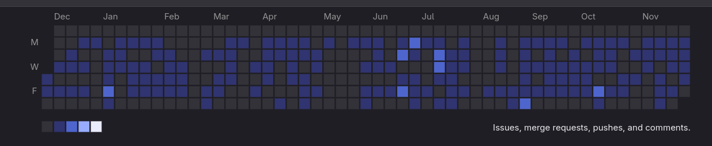

### Hello 0/ 😁
My name is **Júlio Gomes** and I'm proud to share some of my work as a software developer
- [Linkedin](https://www.linkedin.com/in/juliogsn/)

---

### Me
- 🤓 Graduated in computer sciense at [UFERSA](https://ufersa.edu.br/)
- 💻 [SuperOne](https://superone.com.br/) (2021-atual)
- 💻 [Ponto Criativo](https://pontocriativo.com.br/) (2020-2021)
- 💻 Macambit Software Freelancer (2019-2020)

---

> The more I know, the more I know that I don't know 
~ Socrates

#### For job reasons, I also use *Gitlab* and I'm more active there... See my contributions in private projects in *Gitlab* in 2023 :)

